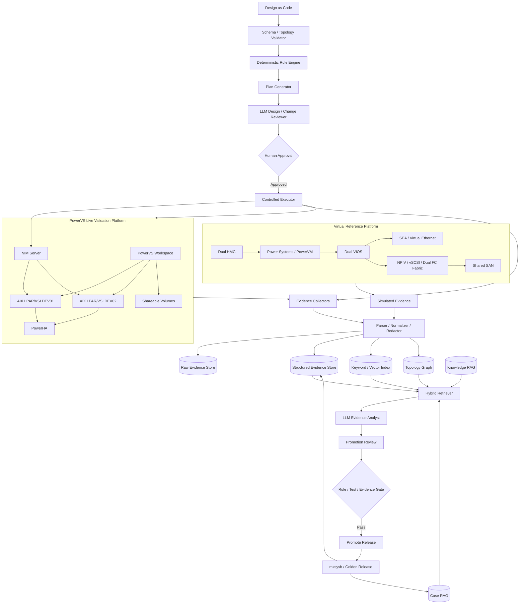
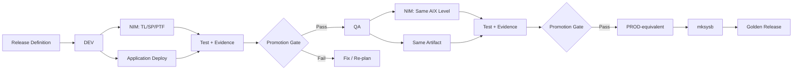
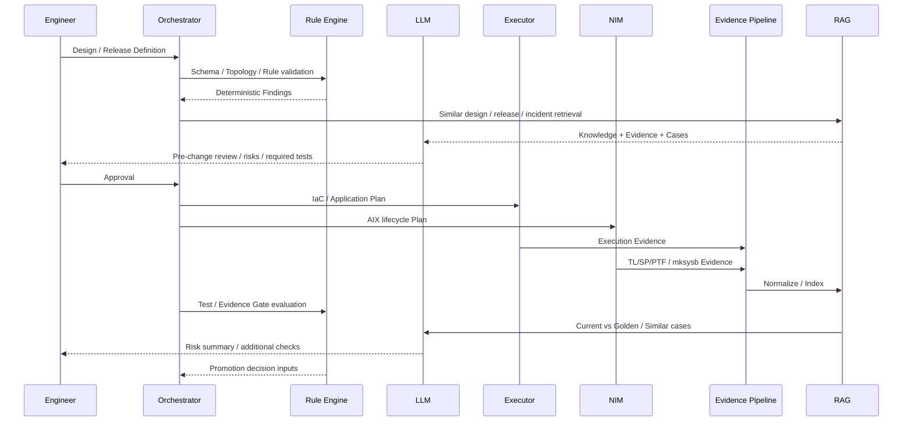

# 3. Architecture

## 3.1 全体構成

本プロジェクトは、**Virtual Reference Platform** と **PowerVS Live Validation Platform** を分離し、その上にIaC、NIM、Release Promotion、Evidence RAG、LLMを配置する。

## 3.2 Power Platform境界

### Virtual Reference Platform
実務で想定するPower基盤全体を論理設計する。

- Dual HMC
- Power Systems / PowerVM
- LPAR Profile
- Dual VIOS
- SEA redundancy
- NPIV / vSCSI
- Dual FC Fabric
- Shared SAN
- AIX LPAR
- PowerHA

PowerVSで直接操作できないHMC / VIOS / SAN層は、設計モデル、Adapter Plan、匿名化・合成した模擬Evidenceで検証する。

### PowerVS Live Validation Platform
実機検証対象。

- PowerVS Workspace
- AIX VSI / LPAR
- CPU / Memory / Network
- PowerVS Volume / Shareable Volume
- AIX hdisk / MPIO
- PVID / VG / LV / JFS2
- Enhanced Concurrent VG
- PowerHA
- NIM
- Failover / Failback
- mksysb
- Evidence収集

PowerVS上で見えない物理層を「存在しないもの」とは扱わない。論理上位層として保持し、実測可能範囲との境界を明示する。

## 3.3 実行部品

既存のPower/AIX向けIaC資産を再利用する。

- PowerVS: Terraform Provider / Module
- AIX: Ansible Collection / shell / NIM
- HMC: HMC向けAnsible Collection等をAdapter化
- VIOS: VIOS向けAnsible Collection等をAdapter化
- PowerHA: PowerHA向けCollection / command Adapter
- Application Deployment: DevOps Deploy等の外部Release Engineを接続可能にする

本プロジェクトは既存Moduleの再実装ではなく、**統合Plan、Evidence Gate、Release Promotion、RAG、LLM、学習**を研究対象とする。

## 3.4 Release Architecture

ReleaseはAIX更新とApplication更新を一体で管理する。

Promotion Gateの確定判定はRule Engine / Test Result / Evidence Comparison / Approved Exceptionで行う。LLMはリスク要約と追加確認提案を担当する。

## 3.5 Evidence / RAG Architecture

RAGは三層構造とする。

### Knowledge RAG
- PowerVM設計原則
- HMC / VIOS
- NPIV / SEA / vSCSI
- SAN / MPIO
- AIX / LVM / JFS2
- NIM
- PowerHA
- Release運用知識

### Evidence RAG
- HMC simulated evidence
- VIOS simulated evidence
- SAN simulated evidence
- PowerVS live evidence
- NIM execution evidence
- AIX / PowerHA live evidence
- Test evidence

### Case RAG
- 正常構築
- Release成功例
- 障害
- 原因
- 是正
- 設計判断
- Regression Case
- Golden Release

検索はStructured / Keyword / Vector / Graphを組み合わせる。

## 3.6 LLM介在点

LLMは以下に限定して高い価値を出す。

1. Design Review
2. Pre-change Impact Review
3. Post-change Evidence Analysis
4. Test Failure Hypothesis / Additional Evidence Suggestion
5. Promotion Risk Summary
6. Golden / Rule / Regression候補生成

LLMは実行、確定Rule判定、昇格可否の最終決定を担当しない。

## 3.7 構築・更新シーケンス

## 3.8 配置モデル

- Control Plane: API、Orchestrator、Rule、Promotion、LLM
- Execution Plane: Terraform / Ansible / NIM / Deploy Adapter
- Evidence Plane: Collectors、Raw Store、Structured Store、Index、Graph
- Learning Plane: Golden、Case、Rule Candidate、Regression
- Approval Plane: GitHub PRまたは専用UI
- Validation Plane: PowerVS + simulated upper Power platform
