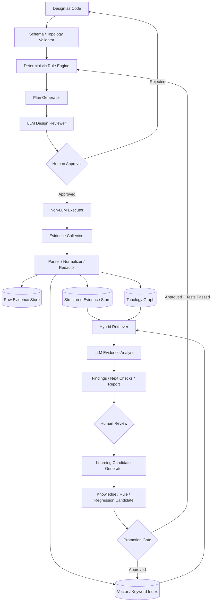
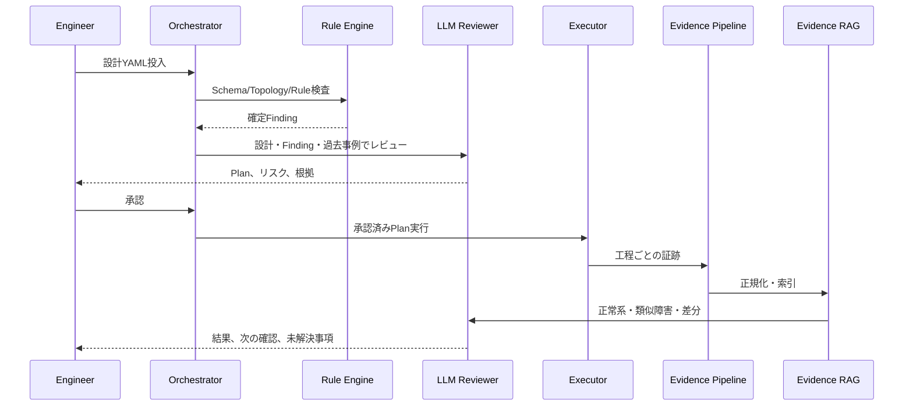

# 3. Architecture

## 3.1 全体構成

## 3.2 中核コンポーネント

### Design Repository
設計YAML、JSON Schema、テンプレート、環境差分、ADRを管理する。

### Topology Validator
設計参照を解決し、LPARからアプリケーションまでの依存関係を構築する。

### Deterministic Rule Engine
確定的に判定可能な問題を検出する。LLMより先に実行し、判定結果を固定する。

### Plan Generator
製品・バージョン別Adapterを使い、実行手順と期待エビデンスを生成する。

### Approval Gateway
Plan、変更差分、リスク、ロールバック方針を人間が承認する。

### Executor
認証情報を保有する唯一の実行コンポーネント。LLMから直接呼び出せない。

### Evidence Pipeline
収集、原本保存、Parse、正規化、匿名化、索引作成を行う。

### Evidence Stores
- Raw Store: 改変しない原本
- Structured Store: 正規化されたFactと関係
- Search Index: VectorとKeyword
- Graph Store: 依存関係と経路

### Hybrid Retriever
構造条件、キーワード、ベクトル、グラフを組み合わせ、根拠を取得する。

### LLM Agents
設計意図、類似事例、原因候補、確認順序、報告書を生成する。

### Learning Pipeline
人間レビュー済みの結果を、ルール、知識、ゴールデンエビデンス、回帰テストへ昇格する。

## 3.3 構築シーケンス

## 3.4 対象技術レイヤー

1. HMC / Managed System
2. PowerVM / LPAR Profile
3. Dual VIOS / vFC / SEAまたは冗長NIC
4. FC Switch / SAN Fabric
5. Storage LUN / Host Mapping
6. AIX MPIO / hdisk / PVID
7. Enhanced Concurrent VG / LV / JFS2
8. PowerHA Cluster / Network / Service IP / RG
9. Application Controller / Monitoring / Backup
10. Failover / Failback / Operational Evidence

## 3.5 配置モデル

初期MVPはローカルまたはCI上で動作する。実機連携時は以下を分離する。

- Control Plane: API、Orchestrator、Rule、RAG、LLM
- Execution Plane: HMC/VIOS/AIXへ到達可能な閉域実行器
- Data Plane: Evidence Store、Graph、Index
- Approval Plane: GitHub Pull Requestまたは専用UI
