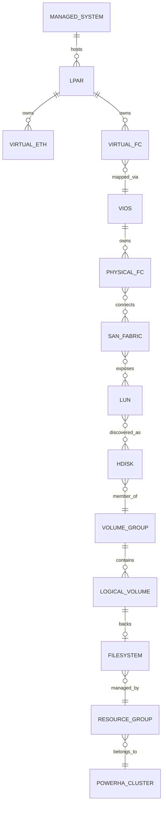

# 4. Domain and Data Model

## 4.1 インフラドメイン



PowerVSでは上記すべてを直接取得できるわけではない。`MANAGED_SYSTEM / HMC / VIOS / SAN_FABRIC`等はVirtual Reference Platform上の論理オブジェクトとして保持し、AIX / PowerHA / Volume等の実測オブジェクトと関連付ける。

## 4.2 Platform Boundary

各オブジェクトに以下を持たせる。

```yaml
management_domain: ibm_managed | project_managed | reference_only
validation_mode: live | simulated | documented
```

これにより、PowerVSで見えない層を消去せず、どこまで実測された設計なのかを明確にする。

## 4.3 エンジニアリングドメイン

- `Design`: 望ましい構成
- `Plan`: 実行予定の変更
- `Execution`: Planの実行単位
- `Release`: AIX更新・Application・Test・Evidenceをまとめた昇格単位
- `Environment`: DEV / QA / PROD-equivalent等の昇格先
- `Promotion`: Releaseを次環境へ昇格する操作と判定
- `EvidencePackage`: ある工程・対象・時点の証跡集合
- `EvidenceItem`: 1コマンド、1API、1設定ファイル等の原本
- `Fact`: Evidenceから抽出した構造化事実
- `Relation`: 対象間の依存関係
- `Finding`: 検出された差分・リスク・異常
- `Decision`: 人間の採用・却下・許容判断
- `Incident`: 障害と影響
- `Remediation`: 是正処置
- `Rule`: 確定判定ロジック
- `KnowledgeItem`: 設計・運用知識
- `Case`: 正常構築、障害、是正、Release結果等の事例
- `GoldenBaseline`: 正常構成の基準
- `GoldenRelease`: 昇格・試験済みReleaseとmksysbを結合した復旧基準
- `RegressionCase`: 過去問題を再検出するテスト

## 4.4 Release

```yaml
release_id: REL-2026-08-001
target_aix:
  oslevel: 7300-02-03
  update_bundle: PTF-2026Q3
middleware:
  version: x.y.z
application:
  artifact: app-2.4.1.tar.gz
  version: 2.4.1
iac:
  git_commit: abcdef0
tests:
  suite_id: compatibility-2026Q3
evidence_baseline_id: GOLD-REL-0004
promotion_state:
  dev: passed
  qa: pending
  prod_equivalent: not_started
```

Releaseは「アプリだけ」または「OSだけ」の単位ではなく、組み合わせとして追跡する。

## 4.5 Golden Release

```yaml
golden_release_id: GOLDREL-0005
release_id: REL-2026-08-001
environment: prod_equivalent
mksysb_id: MK-0005
aix_oslevel: 7300-02-03
ptf_bundle: PTF-2026Q3
application_version: 2.4.1
test_result: passed
evidence_snapshot_id: SNAP-0005
approved_by: human-review
```

mksysbは単なるバックアップではなく、検証済みReleaseの復旧可能な物理的基準として扱う。

## 4.6 EvidencePackage

必須属性:

- package_id
- project_id
- environment
- release_id
- build_run_id
- phase
- target_layer
- target_ids
- collected_at
- collector_version
- source_type
- evidence_origin
- validation_status
- integrity_hash
- confidentiality
- items
- parser_status
- normalization_status

## 4.7 Evidence Origin

```yaml
evidence_origin: live | simulated | documented
validation_status: verified | assumed | unverified
layer: hmc | powervm | vios | san | aix | nim | powerha | application
platform: powervs | virtual_reference | other
```

LLM、Retriever、Reportはこの属性を必ず表示・考慮する。

## 4.8 Fact

FactはParserまたは承認済み抽出器が生成する。

```yaml
fact_id: FACT-000021
subject:
  type: hdisk
  id: hdisk3
predicate: enabled_path_count
value: 3
unit: path
source_evidence_ids:
  - EVI-000334
observed_at: 2026-08-17T12:00:00+09:00
confidence: deterministic
evidence_origin: live
```

## 4.9 Finding

```yaml
finding_id: FIND-000104
category: redundancy
severity: high
subject_ref: hdisk3
summary: Expected four enabled paths but found three
basis:
  rule_ids:
    - RULE-SAN-004
  evidence_ids:
    - EVI-000334
  golden_baseline_ids:
    - GOLDEN-NPIV-2VIOS-001
release_id: REL-2026-08-001
status: open
```

## 4.10 Provenance

基本系:

`Answer -> Finding -> Fact -> EvidenceItem -> EvidencePackage -> Execution -> Plan -> Design`

Release系:

`GoldenRelease -> Release -> Promotion -> TestResult -> EvidenceSnapshot -> mksysb`

## 4.11 バージョニング

- Design: Semantic VersionまたはGit commit
- Release: release_id
- Rule: `rule_id + version`
- Parser: binary/container digest
- Golden Baseline: 承認版 + 対象条件
- Golden Release: release_id + mksysb_id + evidence_snapshot
- LLM Prompt: prompt_id + version
- Retrieval Configuration: index_version + reranker_version
