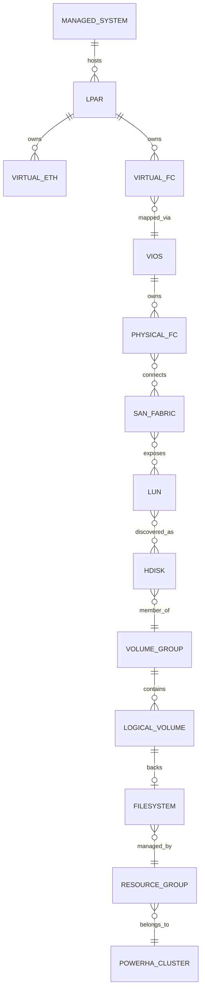

# 4. Domain and Data Model

## 4.1 インフラドメイン



## 4.2 エンジニアリングドメイン

- `Design`: 望ましい構成
- `Plan`: 実行予定の変更
- `Execution`: Planの実行単位
- `EvidencePackage`: ある工程・対象・時点の証跡集合
- `EvidenceItem`: 1コマンド、1API、1設定ファイル等の原本
- `Fact`: Evidenceから抽出した構造化事実
- `Relation`: 対象間の依存関係
- `Finding`: 検出された差分・リスク・異常
- `Decision`: 人間の採用・却下・許容判断
- `Incident`: 障害と影響
- `Remediation`: 是正処置
- `Rule`: 確定判定ロジック
- `KnowledgeItem`: 類似検索用の説明・所見・事例
- `GoldenBaseline`: 正常構成の基準
- `RegressionCase`: 過去問題を再検出するテスト

## 4.3 EvidencePackage

必須属性:

- package_id
- project_id
- environment
- build_run_id
- phase
- target_layer
- target_ids
- collected_at
- collector_version
- source_type
- integrity_hash
- confidentiality
- items
- parser_status
- normalization_status

## 4.4 Fact

Factは、LLMが生ログから直接推測するのではなく、Parserまたは承認済み抽出器が生成する。

例:

```yaml
fact_id: FACT-000021
subject:
  type: hdisk
  id: hdisk3
predicate: enabled_path_count
value: 3
unit: path
source_evidence_ids:
  - EVI-000334
observed_at: 2026-08-03T08:00:00+09:00
confidence: deterministic
```

## 4.5 Finding

```yaml
finding_id: FIND-000104
category: redundancy
severity: high
subject_ref: hdisk3
summary: Expected four enabled paths but found three
basis:
  rule_ids:
    - RULE-SAN-004
  evidence_ids:
    - EVI-000334
  golden_baseline_ids:
    - GOLDEN-NPIV-2VIOS-001
status: open
```

## 4.6 Provenance

すべてのFact、Finding、回答は、原本Evidenceまで逆引き可能にする。

`Answer -> Finding -> Fact -> EvidenceItem -> EvidencePackage -> Execution -> Plan -> Design`

## 4.7 バージョニング

- Design: Semantic VersionまたはGit commit
- Rule: `rule_id + version`
- Parser: 実行バイナリまたはコンテナDigest
- Golden Baseline: 承認版と対象条件を固定
- LLM Prompt: prompt_id + version
- Retrieval Configuration: index_version + reranker_version
