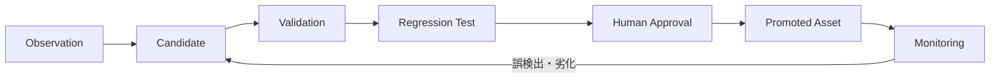

# 8. Learning Loop Design

## 8.1 自律成長の定義

モデル自体が勝手に再学習することではない。構築経験を、検索知識、正常系基準、確定ルール、回帰テスト、設計テンプレートへ変換し、次回以降の能力を高めることを指す。

## 8.2 学習入力

- 構築前後Evidence
- 正常/異常判定
- 人間レビュー
- 障害記録
- 根本原因
- 是正結果
- Failover試験
- LLM指摘の採否
- 誤検出・見逃し
- 構築所要時間

## 8.3 学習成果物

1. Knowledge Item
2. Golden Baseline
3. Rule Candidate
4. Regression Case
5. Parser Improvement
6. Design Template Update
7. Prompt Improvement
8. Retrieval Tuning

## 8.4 昇格フロー

## 8.5 Rule Candidate生成

障害または差分から以下を生成する。

- 検出対象
- 条件式
- 適用条件
- Severity
- 説明
- 根拠Evidence
- 既知の例外
- テストケース

LLMは候補を生成できるが、正式Ruleには直接反映しない。

## 8.6 Golden Baseline更新

同一構成の複数成功例から共通属性を抽出する。単一案件の値を普遍化しない。

更新条件:

- 成功試験済み
- 人間承認済み
- 機密除去済み
- 対象バージョン明示
- 未解決Findingの扱い明示

## 8.7 回帰試験

障害ごとに以下を保存する。

- failing_design
- failing_evidence
- expected_findings
- expected_evidence_refs
- remediation
- passing_evidence

CIは「過去に学んだ事故を忘れていないか」を検証する。

## 8.8 Retrieval改善

検索ログから以下を評価する。

- 正解事例が上位に出たか
- 不要事例が混入したか
- バージョン差を誤適用したか
- 人間が別事例を採用したか

評価結果はMetadata、Query Expansion、Reranker改善へ反映する。

## 8.9 学習レベル

### Level 1: Assisted
候補生成のみ。人間がすべて採否判断。

### Level 2: Controlled
承認済みKnowledgeの索引更新を自動化。Rule昇格は手動。

### Level 3: Policy-driven
低リスクMetadata・タグ・検索同義語を自動更新。Ruleはテスト・承認必須。

初期目標はLevel 2とする。
