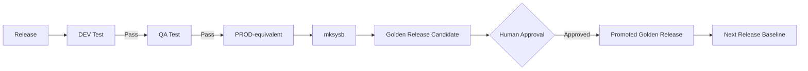
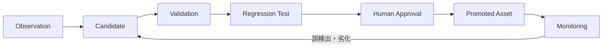

# 8. Learning Loop Design

## 8.1 自律成長の定義

本プロジェクトにおける自律成長とは、モデル自体が勝手に再学習することではない。構築・更新・昇格・試験・障害対応で得た経験を、Knowledge、Golden Baseline、Golden Release、Rule、Regression Test、Parser改善、Retrieval改善へ変換し、次回以降の能力を高めることを指す。

## 8.2 学習入力

- Design / Plan
- PowerVS live Evidence
- HMC / VIOS / SAN simulated Evidence
- NIM更新前後Evidence
- TL / SP / PTF適用結果
- Application Deploy結果
- Test結果
- Promotion結果
- mksysb metadata
- PowerHA Failover / Failback結果
- 人間レビュー
- 障害記録
- 根本原因
- 是正結果
- LLM指摘の採否
- 誤検出・見逃し
- 構築・更新所要時間

## 8.3 学習成果物

1. Knowledge Item
2. Golden Baseline
3. Golden Release
4. Rule Candidate
5. Regression Case
6. Parser Improvement
7. Design Template Update
8. Release Template Update
9. Prompt Improvement
10. Retrieval Tuning
11. Test Suite Improvement

## 8.4 Promotionと学習

Release Promotionを主要な学習イベントとして扱う。

Promotion成功は「このAIXレベル・PTF・Application・IaC・Testの組み合わせが検証済み」であることを示す。

## 8.5 Candidate Promotion Flow

## 8.6 Golden Baseline

構成単位の正常Evidenceを保持する。

例:
- MPIO正常パス構成
- Enhanced Concurrent VG
- PowerHA RG状態
- NIM client定義

単一案件の値を普遍化せず、適用条件と製品Versionを保持する。

## 8.7 Golden Release

Release単位の検証済み状態を保持する。

昇格条件:

- target environmentまでPromotion成功
- 必須Test PASS
- 必須Evidence取得済み
- 未解決Critical Findingなし
- 例外がある場合は承認済み
- mksysb取得済み、または取得不要理由を記録
- Human Review済み

保存対象:

- Release Definition
- AIX oslevel
- PTF / TL / SP
- Middleware / Application version
- IaC commit
- Rule set version
- Test result
- Evidence Snapshot
- Approved exceptions
- mksysb reference

## 8.8 Rule Candidate

障害、Test failure、Promotion failure、Evidence差分から以下を生成する。

- 検出対象
- 条件式
- 適用条件
- Severity
- 説明
- 根拠Evidence
- Evidence origin
- 既知の例外
- Test case

LLMはCandidate生成まで。正式Ruleへの昇格はRegression + Human Approvalを必須とする。

## 8.9 Regression Case

過去問題ごとに以下を保存する。

- failing_design
- failing_release
- failing_evidence
- expected_findings
- expected_evidence_refs
- remediation
- passing_evidence
- affected_aix_level
- affected_application_version

CIは「過去に学んだ問題を忘れていないか」を検証する。

## 8.10 Retrieval改善

検索ログから以下を評価する。

- 正解Caseが上位に出たか
- live Evidenceよりsimulated Evidenceを過大評価していないか
- AIX level / PTF / Application version差を誤適用していないか
- 人間が別Caseを採用したか
- Promotion判断支援に有効だったか

評価結果をMetadata、Query Expansion、Reranker、Graph traversalへ反映する。

## 8.11 Learning Level

### Level 1: Assisted
Candidate生成のみ。人間が採否を判断する。

### Level 2: Controlled
承認済みKnowledge、Case、Golden Releaseの索引更新を自動化する。Rule昇格は手動。

### Level 3: Policy-driven
低リスクMetadata、Tag、検索同義語等を自動更新する。Rule、Promotion Policy、Golden Releaseは承認必須。

初期研究目標はLevel 2とする。
