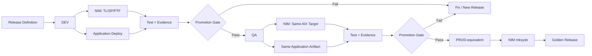

# 11. Release Promotion Design

## 11.1 目的

AIX標準にはSAP TMSのようなDEV -> QA -> PRODのTransport機構が存在しないため、本研究ではNIMによるAIX LifecycleとApplication Deploymentを統合し、Release Promotion Pipelineを構成する。

目的は、**同一のAIX更新・Application artifact・IaC・Test条件を複数環境で順次検証し、Evidenceに基づいて昇格させること**である。

## 11.2 基本構成



## 11.3 Release Definition

Releaseは最低限以下を含む。

```yaml
release_id: REL-2026-08-001
base_golden_release: GOLDREL-0004

aix:
  target_oslevel: 7300-02-03
  update_type: ptf_bundle
  update_bundle: PTF-2026Q3

middleware:
  version: x.y.z

application:
  artifact: app-2.4.1.tar.gz
  version: 2.4.1
  checksum: sha256:...

iac:
  git_commit: abcdef0

tests:
  suite_id: compatibility-2026Q3
  require_powerha_failover: true

promotion_policy:
  required_evidence_coverage: 0.90
  max_critical_findings: 0
  max_unapproved_high_findings: 0
```

## 11.4 NIMの役割

NIMはAIX Lifecycle / Recovery Engineとして利用する。

対象:

- client管理
- TL / SP / PTF適用
- optional software配布
- pre/post update Evidence取得支援
- mksysb取得
- 将来の復旧/再構築連携

NIMはPromotion Engineそのものではない。Release OrchestratorがNIM操作を工程として呼び出す。

## 11.5 Application Deploymentの役割

Application artifactの配布は、DevOps Deploy等の外部Release Engine、Ansible、または専用Adapterを利用できる。

要件:

- DEV / QA / PROD-equivalentで同一artifact identityを保証する
- checksumを保持する
- deployment resultをEvidence化する
- rollback可能な場合は旧artifactとの対応を保持する

## 11.6 DEV工程

1. Base Golden Releaseを確認
2. Pre-change Evidence取得
3. LLM Pre-change Review
4. Human Approval
5. NIMからAIX更新
6. Post-update Evidence取得
7. Application artifact deploy
8. Compatibility / Regression Test
9. PowerHA test（要求Releaseのみ）
10. Evidence Comparison
11. Promotion Gate
12. LLM Risk Summary
13. Human Promotion Approval

DEVは変更を最初に組み合わせて検証する環境とする。

## 11.7 QA工程

QAではDEVで合格した**同一Release**を再現する。

重点:

- AIX target level一致
- PTF / fileset一致
- artifact checksum一致
- IaC version一致
- Test Suite一致
- DEV Golden Evidenceとの差分把握
- DEVで発見した追加Testを再実行

DEVでの偶然の成功をQAで再現性として検証する。

## 11.8 PROD-equivalent工程

個人研究では本番業務環境ではなく、Production相当の最終検証環境を想定する。

重点:

- QA合格Releaseの再現
- 最終Promotion Gate
- Failover / Failback
- Recovery確認
- Evidence Snapshot固定
- mksysb取得
- Golden Release作成

## 11.9 Promotion Gate

確定判定はRule Engineで行う。

```text
Required Tests == PASS
AND Critical Findings == 0
AND Unapproved High Findings == 0
AND Evidence Coverage >= threshold
AND AIX Target Level == Expected
AND Artifact Hash == Expected
AND Required PowerHA Verification == PASS
```

LLMはこの式を置き換えない。

LLMは以下を補助する。

- 過去Caseとの関連
- 想定外差分の意味
- 次環境で追加すべきTest
- 人間向けRisk Summary

## 11.10 PTF適合検証

AIX更新とApplication変更を別々に成功判定しない。

```text
NIM Update Success
        +
Post-update AIX Evidence
        +
Application Deploy Success
        +
Compatibility / Regression Test
        +
PowerHA / Operational Test
        =
Promotion Candidate
```

これにより「PTF適用自体は成功したがApplicationが壊れた」という状態を昇格させない。

## 11.11 mksysbとGolden Release

最終昇格後にNIMからmksysbを取得する。

Golden Releaseは以下を結合する。

```text
Release ID
 + AIX oslevel
 + PTF / TL / SP
 + Middleware Version
 + Application Version / Hash
 + IaC Commit
 + Test Result
 + Evidence Snapshot
 + Approved Exceptions
 + mksysb Reference
```

mksysbはバックアップデータそのものをGitへ入れず、NIM object / storage location / integrity metadataだけを管理する。

## 11.12 LLMの介在

### Pre-change
- 過去Golden / Case検索
- PTF / Application組み合わせのリスク候補
- 必要Test候補

### Post-NIM Update
- fileset / oslevel / errpt等の差分意味付け
- 想定外差分抽出結果の説明

### Test Failure
- 原因候補順位付け
- AIX / Application / Middleware / Storage / PowerHAの切り分け候補
- 追加Evidence提案

### Promotion
- Rule/Test/Evidence結果のRisk Summary

### Post-promotion
- Golden Release候補生成
- Knowledge / Rule / Regression候補生成

## 11.13 インシデントとの境界

Release/Test中に発生した問題はCase RAGへ蓄積するが、本プロジェクトはITSMそのものを実装しない。

扱う:
- Failure Case
- Evidence
- Root Cause
- Remediation
- Regression

扱わない:
- Incident ticket lifecycle
- SLA management
- Assignment / escalation
- ServiceNow代替
- 自律Incident Commander

## 11.14 研究上の評価点

- DEVで成功したReleaseがQAで再現できるか
- AIX更新とApplication適合性をEvidenceで説明できるか
- LLMが追加したTestが実際に有効か
- Promotion Gateが誤昇格を防げるか
- Golden Releaseが次回変更前レビューを高速化するか
- mksysbとの関連付けが復旧設計を改善するか
